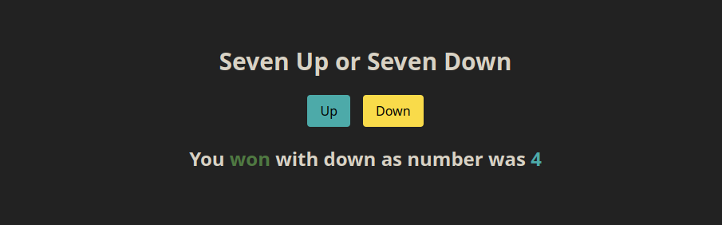

# Seven Up Seven Down



<p align="center">
<a href="https://seven-up-seven-down.vercel.app/">Live Demo</a><br/>
React | Tailwind | Soroban | Rust
</p>

## How to Play

Predict whether the sum of two dice will be greater than or less than 7 on Soroban (Japanese abacus).

The randomisation is based on random generator from the Soroban smart contracts written on the Stellar blockchain on the Futurenet.


`Note: The Futurenet is a test network and the XLMs used here are test XLMs.`


The Smart contract can be viewed [here](./contract-src/src/lib.rs).

## Requirements

1. [Node.js](https://nodejs.org/en/)
2. [Soroban CLI]()
3. [Rust](https://www.rust-lang.org/tools/install)
4. [Cargo](https://doc.rust-lang.org/cargo/getting-started/installation.html)

## Steps Involved in Integrating a Soroban Smart Contract with a React App

1. Install Rust & Wasm32 Target

```bash
curl --proto '=https' --tlsv1.2 -sSf https://sh.rustup.rs | sh
rustup target add wasm32-unknown-unknown
```

2. Install Soroban CLI

```bash
cargo install --locked --version 20.0.0-rc.4.1 soroban-cli
```

3. Configure the Futurenet:

```bash
soroban config network add --global futurenet \
  --rpc-url https://rpc-futurenet.stellar.org \
  --network-passphrase "Test SDF Future Network ; October 2022"
```

4. Create an Identity on the Futurenet:

```bash
soroban config identity generate --global <your-name>
```

5. Store the address of the account generated above:

```bash
soroban config identity address <your-name>
```

6. Fund the address with text XLMs:

```bash
soroban config identity fund <address-found-above> --network futurenet
```

7. Compile the Contract to a release wasm

```bash
cd contract-src
cargo build --target wasm32-unknown-unknown --release
```

8. Deploy the Contract to Futurenet & store the contract address:

```bash
soroban contract deploy \
  --wasm target/wasm32-unknown-unknown/release/seven_up_seven_down.wasm \
  --source <your-name> \
  --network futurenet > .soroban/seven-up-seven-down
```

9. Test the Contract by Invoking it from the CLI:

```bash
soroban contract invoke \
  --id $(cat .soroban/seven-up-seven-down) \
  --source <your-name> \
  --network futurenet \
  -- \
  play \
  --prediction down
```

And the output should be something like: `["You","won","with","down","as","number","was","1"]`.

10. Now to integrate this with the React App, we need to generate bindings for the contract:

```bash
cd ..
soroban contract bindings typescript \
  --network futurenet \
  --contract-id $(cat ./contract-src/.soroban/seven-up-seven-down) \
  --output-dir node_modules/seven-up-seven-down
```

The above should create an npm module in the `node_modules` directory.

11. Install dependencies in the React App

```bash
npm install
```

12. Start the app

```bash
npm start
```

## Debugging

If you run into any versioning errors on the browser or something like "Maximum TTL reached", please run the helper script [./update-stellar-sdk.sh](./update-stellar-sdk.sh) and then start the app again!
